# Headway

A Pebble watchface that reads past a sleeve, and knows when you are near a
bus. Most of the day it is a plain watch: the time, your heart rate and the
weather, the date. Walk into a transit centre it knows and it becomes a
countdown to the next departure. Flick your wrist at a stop and it tells you
what leaves from there next.

| the watch | at the transit centre | a flick at a stop |
|---|---|---|
| 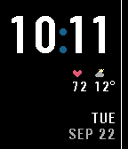 | 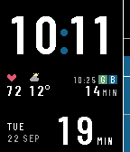 | 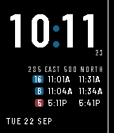 |

## Read past a sleeve

A cuff slides in from the wrist side and uncovers the outer edge first, so
everything on the face hangs from that edge in order of how much you need
it. The minute digits sit flush to it and survive a cuff that hides the
hour. The modules and the date hang from it too, the number of the date on
the edge itself: `SEP 22`. When there is a countdown it takes that edge and
the date moves to the wrist side, first to go. A rail down the outer edge
drains as the headway runs out, readable as a shape under any sleeve. On the
right wrist the whole layout mirrors.

## Out of the box

The time, two modules and the date. The modules are heart rate and the
weather, drawn as icons in colour: the heart red, the sun yellow by night and
orange by day, rain blue, clouds grey. A watch without a heart-rate sensor
shows its battery in that slot. The theme is dark through the night and light
by day; the night window is yours to set.

| dark | light | captions instead |
|---|---|---|
|  | 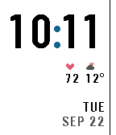 | 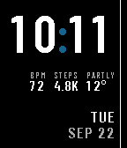 |

Three module slots take heart rate, steps, battery, weather or nothing, as
captions (`BPM 72`, `PARTLY 12°`), as grey icons, or as icons in colour. A
module with nothing to show — the weather before its first fetch — simply
does not appear. Weather comes from [Open-Meteo](https://open-meteo.com),
which needs no key.

## Near a system it knows

The face knows some transit systems: each one's hub, its hours, the routes
that leave the hub on their own timetable, and every stop. By default the
phone checks where it is now and then, coarsely, and the face changes by the
answer. Outside every known system nothing changes and it asks less often.

**At the hub**, in its hours, the countdown appears: minutes to the next
departure, at the outer edge. Five minutes out the block goes solid, with an
optional buzz; at zero it reads `NOW` for a minute. The last minute counts
in seconds. Routes that keep their own timetable get a second countdown as
colour chips in the module band, with their departure's clock time small
beside them, and their last minute counts in seconds too.

| waiting | boarding | departing |
|---|---|---|
|  | 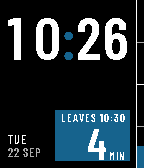 | 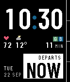 |

**A flick of the wrist** anywhere inside the system asks the phone for a
precise fix and, for twelve seconds, lit, the face answers with the nearest
stop. The answer is counted in rows, not metres. One row — one route, one
direction — sits in the band beside the modules as three short lines: the
stop, the badge and its next time, then how far, or the time after when you
are standing there. The rest of the face stays. Two or three rows take the
board: the time full size, the stop's name, a row a route with its badge in
the agency's own colour and two columns, and a small date at the foot. The
first column is the next time; the second holds one thing: the day when
today's buses are done (`5:12P TOMORROW`, `5:00A MON`), the direction where a
route runs both ways from a pair of stops across a road (`NORTH`, `SOUTH`),
otherwise the time after. Times read in the watch's own clock style, and
while the answer shows, the seconds sit small beneath the time at its outer
edge, since a board read against a timetable wants to know where in the
minute it is.

| one row, beside the modules | the board | a pair of stops, light |
|---|---|---|
| 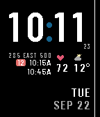 |  | 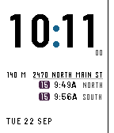 |

Stops across a road from each other are read as one, and at the hub every
bay is, under the hub's own name. Off the stop, the line says how far.
Further than two kilometres from any stop a flick only lights the face:
nothing is taken away to say there is nothing. The countdown steps aside for
a board and is back the moment it goes.

The face knows one system so far: Connect, the Cache Valley Transit District
in Logan, Utah, whose routes leave the transit centre on the half hour and
whose G and B loops keep their own timetable. Adding another is a GTFS feed
and a hub; see Data below.

## Countdown everywhere

The face began as a countdown for any fixed-headway service — a train every
half hour, a shuttle every twenty minutes — and that is still here as a
setting. Choose it and the countdown runs wherever you are, from a headway
and a departure offset you set, with the hub's extras when you are at one.

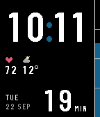

## Settings

From the Pebble app.

- **Transit** — automatic (default), countdown everywhere, or off. With it:
  how near the hub counts as at it, and a switch for the flick.
- **Headway** and **departure offset** — for the countdown: 30, 20 or 15
  minutes, and minutes past the hour.
- **Boarding buzz** — one pulse at five minutes, off by default.
- **Theme** — dark at night and light by day, with the night window; or
  dark; or light.
- **Accent** — any colour; the rail, the colon and the boarding block.
- **Wrist** — left or right.
- **Time format** — the system's, 12-hour or 24-hour.
- **Modules** — three slots, and captions, icons or icons in colour.
- **Units** — °C or °F, metres or feet.

## Data

The watch never reads a feed. `tools/transit.py` reduces an agency's GTFS to
what the phone needs — the hub, its hours, the departures of the routes on
their own timetable, and a file per stop with its scheduled departures by
day — and writes `src/pkjs/transit.json` for the app and `docs/data/` for
GitHub Pages, where the phone fetches stop files on a flick and caches them.
A nightly workflow refetches the feed and commits what changed. Everything
shown is a schedule; there is no live data yet.

To add a system: run `tools/transit.py` with the feed, the hub's position and
name, and the routes that keep their own timetable, and add the same line to
`.github/workflows/transit.yml`.

## Platforms

Rectangular displays: `aplite`, `basalt`, `diorite` and `flint` (144×168) and
`emery` (200×228). The layout is an edge-flush rail on a rectangle, so the
round `chalk` and `gabbro` are not targeted.

| aplite | diorite | emery | flint |
|---|---|---|---|
| 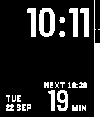 |  | 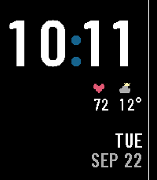 |  |

On one-bit watches the accent becomes ink, the badges go solid, and the
hairline under a stop name dots.

Every watch gives a face about 2 KB of stack, and the firmware's text
renderer wants well over half of it for each call. So the face keeps almost
nothing of its own beneath that call: each zone is laid out into static
storage and its painter hands one run of text at a time to a single small
leaf. Measured with the stack painted and read back, the deepest frame is
1800 bytes on `basalt` and on `flint`. Any new painter is written the same
way and measured before it ships.

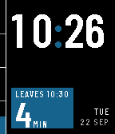

## Building

```bash
npm install
pebble build
pebble install --emulator basalt
```

The fonts are prebuilt. To regenerate them after changing a size or a
character set in `tools/genfonts.py`:

```bash
~/.local/share/uv/tools/pebble-tool/bin/python tools/genfonts.py
```

## Type

[Barlow Condensed](https://github.com/jpt/barlow) SemiBold at fixed pixel
sizes: 60px time (83 on emery), 44px countdown, 15px module values, 11px
labels, 12px date, 9px captions. Digits are set tabular and labels tracked
by drawing a glyph at a time. The board's clock times are the one exception:
Barlow Semi Condensed, the wider cut.

The SDK's font generator rasterises through the font's own hints, which
scatter one- and two-pixel stems across the small sizes. `tools/fontgen.py`
is that generator, vendored with FreeType's auto-hinter forced, and the
`.pfo` blobs it writes ship as raw resources. Icons are hand-placed 10×10
pixel patterns, scaled by nearest neighbour, so they invert with the theme
and hold their shape on emery.

The face was designed with [Claude Design](https://claude.ai/design) and
built with Claude Code.

## Licence

Code under the MIT licence, see `LICENSE`. Barlow Condensed and Barlow Semi
Condensed are under the SIL Open Font License, see `resources/fonts/OFL.txt`.
