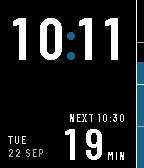
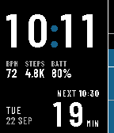
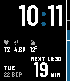
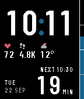
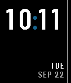
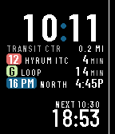
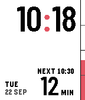

# Headway

A Pebble watchface for riding a fixed-headway service — a train, a ferry, a
shuttle — where what you actually need to know is *how much of this half hour
is left*.

Built from a [Claude Design](https://claude.ai/design) spec.

| Waiting | Boarding | Departing |
|---|---|---|
|  |  |  |

## Read it from the cuff in

A sleeve slides in from the wrist side and uncovers the far edge first, so the
face ranks its information by edge:

| Zone | | |
|---|---|---|
| **01 Rail** | outer edge | A 7px column that drains as the headway runs out. Ticks at ¼, ½ and ¾. Readable as a shape under any cuff, and at arm's length while driving. |
| **02 Countdown** | | Minutes to the next departure, with its clock time. At five minutes the block fills solid; at zero it reads `NOW` for one minute, then rolls to the next run. |
| **03 Minute** | | The time sits flush to the outer edge, so the minute digits survive a cuff that hides the hour. |
| **04 Hour & date** | wrist side | First to disappear. |

## Modules

Off by default: out of the box the face is the plain digital watch the design
describes. Up to three can be switched on from the settings page, in the band
the design leaves open, drawn as a caption over a value — `BPM 72`,
`STEPS 4.8K`, `BATT 64%`. Each slot takes heart rate, steps, battery, weather
or nothing, and the captions can be swapped for icons, grey or in colour.
In colour, the heart is red, the battery shows its charge, and the sky comes
in its own colour: the sun and a bolt yellow, orange by day, rain blue. Steps and every
cloud keep the caption grey, so colour only ever says something.

| Captions | Icons | In colour |
|---|---|---|
|  |  |  |

They sit on the wrist side, below the date, so a sleeve covers them before the
countdown or the rail — the design's zone ranking is preserved.

Weather captions with the sky itself — `CLOUDY 12°` — rather than the unit,
and as an icon draws it: sun, partly cloudy, cloud, fog, rain, snow or
thunder, from the WMO code. A module whose sensor is unavailable — heart rate
on a watch without the sensor, weather before the first fetch — simply does
not appear.

## States

- **Waiting** — more than five minutes out. Quiet.
- **Boarding** — five minutes out, the block goes solid. Optional single buzz.
- **Departing** — rail empty, `NOW` for one minute.

When a timeline peek covers the bottom third of the screen, the face reflows
into what is left, as the design has it: the date goes first, the time and
the countdown step down a size, and the modules and the second countdown keep
their band. The rail draws to the visible height, so its fill still reads.

## Settings

Reachable from the Pebble app.

- **Headway** — 30 / 20 / 15 minutes between runs
- **Departure offset** — minutes past the hour of the first run
- **Boarding buzz** — a single pulse at T-5, off by default
- **Theme** — dark at night and light by day (default), with a configurable night window; or dark, or light
- **Accent** — any colour; drives the rail, the colon and the boarding block
- **Wrist** — mirrors the whole layout so the sleeve comes from the other side
- **Time format** — system, 12h or 24h
- **Modules** — three slots: heart rate, steps, battery, weather or nothing
- **Captions or icons** — captions, icons, or icons in colour
- **Units** — °C or °F
- **Knowing a system** — see below; automatic by default, with the hub radius and a switch for the flick

Weather comes from [Open-Meteo](https://open-meteo.com), which needs no API key
and no account.

## Near a system it knows

The face knows some transit systems: each one's hub, its hours, the routes
that leave the hub together on their own timetable, and every stop. By
default it is automatic: the phone asks where it is now and then, coarsely,
and inside a known system's area the face changes by the answer. Outside
every known system it is the plain watch, and it asks less often.

- **At the hub, in its hours** — the countdown runs as ever, and the routes
  on their own timetable get a second one, in the module band, at the end
  furthest from the cuff: a chip per route and the minutes to the next
  departure. If the two have parted, the later one's chip goes dim.
- **Elsewhere in the system** — the countdown runs as ever, and a flick shows
  the nearest stop.

Two always-on choices in settings replace the automatic one: the second
countdown near the hub with the half-hour countdown everywhere, wherever you
are — set the radius wide and it is there for the drive in — or both only
near the hub, with the face quiet anywhere else or after hours: no countdown,
a larger date, and the date and modules moved to the outer end, out from
under a sleeve. And off.

| at the hub | quiet, away from it |
|---|---|
|  |  |

The phone's word holds for three hours; if it goes quiet longer than that, the
face falls back to the plain countdown rather than stay quiet on a stale fix.

The face knows one system so far: the Cache Valley Transit District in Logan,
Utah, whose routes leave the transit center on the half hour and whose G and
B keep their own timetable. `tools/transit.py` reduces an agency's GTFS to
what the phone needs — the hub, its hours, those departures, the area its
stops cover — and adds it to `src/pkjs/transit.json`; the watch never reads
the feed.

### A flick for the nearest stop

With the hub known, a flick of the wrist asks the phone where you are, this
time precisely, and for twelve seconds, lit, the face shows the nearest stop
and what leaves it next. The time steps down a size to make the room; the
stop's line and its rows take it — the route in the agency's own colour, where
it is going, and the minutes, or the clock time once it is more than an hour
out; and the countdown stays at the foot, a size down but still the largest
number on the face, and for those seconds it runs in seconds, minutes and
seconds together. Nothing is lost to a flick, least of all a bus boarding or
NOW. Date and modules sit it out. Stood at the stop, the line is just its
name; further off, it says how far. Twin stops across a road are read as one,
and at the hub every bay is, under the hub's own name: TRANSIT CTR. Nothing
within a mile and a half, and it says so. A setting turns the flick off
altogether.

| at a stop | near one |
|---|---|
|  |  |

The departures come from a small file a stop, served from this repository's
pages and rewritten every night from the agency's feed by a workflow, so the
watchface never needs a release for a timetable change. The phone caches what
it fetches.

The face knows one hub so far: the Cache Valley Transit District's transit
center in Logan, Utah, where most routes leave on the half hour and routes
G and B keep their own timetable. `tools/transit.py` reduces an agency's GTFS
to what the phone needs — the hub, its hours, those departures — and writes
`src/pkjs/transit.json`; the watch never reads the feed.

## Platforms

Rectangular displays only: `aplite`, `basalt`, `diorite` and `flint` (144×168)
and `emery` (200×228). The layout is an edge-flush rail on a rectangle, which a round
screen cannot carry without a different design, so `chalk` and `gabbro` are
not targeted.

Every watch gives a face about 2KB of stack, and the firmware's text renderer
wants well over half of it for each call. So the face keeps almost nothing of
its own beneath that call: each zone is laid out into static storage, and the
painters hand their text to one small leaf. Measured with the stack painted
and read back, a full frame with three modules peaks at 1752 bytes on
`basalt` and 1776 on `flint`, which is what lets `flint` (Core 2 Duo) ship
again after 1.0.3 and 1.0.4 left it out.

| aplite | diorite | flint | emery |
|---|---|---|---|
|  |  |  |  |

On one-bit watches the accent becomes ink and the quarter-hour ticks dither,
as the design's mono note asks. A module whose sensor the watch lacks — heart
rate on aplite, say — removes itself rather than showing a blank.

Light mode with the accent set to red, and the right-wrist layout, mirrored
so the sleeve comes from the other side:

| Light | Right wrist |
|---|---|
|  |  |

## Building

```bash
npm install
pebble build
pebble install --emulator basalt
```

The fonts are prebuilt. To regenerate them after changing a size or a
character set in `tools/genfonts.py`:

```bash
~/.local/share/uv/tools/pebble-tool/bin/python tools/genfonts.py
```

## Type

Everything is [Barlow Condensed](https://github.com/jpt/barlow) SemiBold, as
the design draws it, at the design's sizes: 60px numerals (83px on emery),
44px countdown, 11px labels, 12px date and 9px module captions. Digits are
set tabular and the labels tracked, as the design's CSS has them, by drawing
a glyph at a time.

The SDK's font generator rasterises through the font's own hints, which
scatter one- and two-pixel stems across the small sizes. `tools/fontgen.py`
is that generator, vendored from the SDK with FreeType's auto-hinter forced,
and the `.pfo` blobs it writes ship as raw resources, which
`fonts_load_custom_font` takes as it would any font.

Module icons are hand-placed pixel patterns, scaled by nearest neighbour, so
they invert with the theme and hold their shape on emery at no resource cost.

## Licence

Code under the MIT licence, see `LICENSE`. Barlow Condensed is under the SIL
Open Font License, see `resources/fonts/OFL.txt`.
