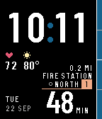
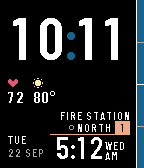

# Headway

A Pebble watchface that reads past a sleeve, and knows when you are near a
bus. Most of the day it is a plain watch: the time, your heart rate and the
weather, the date. Walk into a transit centre it knows and it becomes a
countdown to the next departure. Flick your wrist at a stop and it counts
down to the next bus from there.

| the watch | at the transit centre | a flick at a stop |
|---|---|---|
|  |  |  |

## Read past a sleeve

A cuff slides in from the wrist side and uncovers the outer edge first, so
everything on the face hangs from that edge in order of how much you need
it. The minute digits sit flush to it and survive a cuff that hides the
hour. The modules and the date hang from it too, the number of the date on
the edge itself: `SEP 22`. When there is a countdown it takes that edge and
the date moves to the wrist side, first to go. A rail down the outer edge
drains as the headway runs out, readable as a shape under any sleeve. Without
a countdown the edge is bare, until a flick: then a hairline down it drains
for as long as the flick's answer stays. On the right wrist the whole layout
mirrors.

## Out of the box

The time, two modules and the date. The modules are heart rate and the
weather, drawn as icons in colour: the heart red, the sun yellow by night and
orange by day, rain blue, clouds grey. A watch without a heart-rate sensor
shows its battery in that slot. The theme is dark through the night and light
by day; the night window is yours to set.

| dark | light | captions instead |
|---|---|---|
|  |  |  |

Three module slots take heart rate, steps, battery, weather or nothing, as
captions (`BPM 72`, `PARTLY 12°`), as grey icons, or as icons in colour. A
module with nothing to show — the weather before its first fetch — simply
does not appear. Weather comes from [Open-Meteo](https://open-meteo.com),
which needs no key.

When rain is due within the hour, the quiet face gives it the column beside
the modules and the date: `RAIN IN` over a big `15 MIN`, rounded up to five
minutes since the forecast comes by the quarter hour. Only then; dry, the
column stays empty. It rides on the same weather check, so it needs no flick
and sends nothing more. A flick's answer takes the place first. Not on the
Classic, whose memory is spoken for.

## Near a system it knows

The face knows some transit systems and every stop in them. Most are just
that: stand at a stop, flick, and the face counts down to the next bus from
it. One kind is more: a system built around a hub, a transit centre whose
routes leave together, where the countdown comes on by itself. By default
the phone checks where it is now and then, coarsely, and the face changes by
the answer. Outside every known system nothing changes and it asks less
often.

**At the hub**, in its hours, the countdown appears: minutes to the next
departure, at the outer edge. Five minutes out the block goes solid and the
watch buzzes once; at zero it reads `NOW` for a minute. The last minute counts
in seconds. Routes that keep their own timetable get a second countdown as
colour chips in the module band, with their departure's clock time small
beside them, and their last minute counts in seconds too.

| waiting | boarding | departing |
|---|---|---|
|  |  |  |

**A flick of the wrist** anywhere inside the system asks the phone where it
is, and the face answers with a countdown to the next bus from the nearest
stop: the route's badge over the big minutes, the stop's name beside the
modules, and how far it is when the fix puts you off it. The face never
asks for high accuracy; it takes the phone's everyday fix at its word, and
the nearest stop within that accuracy is yours, with its twin across the road
and, at a station, every bay. The countdown is the hub's countdown, at any
stop: solid at five minutes with a buzz, `NOW` in its minute, the last minute
in seconds. When the bus goes it moves on to the stop's next bus, and so on
until the day's buses are done, you flick somewhere else, or the phone's
half-hourly look finds you well away from the stop. Nothing is checked
meanwhile; it simply runs. A bus more than an hour off reads as its clock
time, `1:21 PM`, a size down; a bus another day's has its day beside the
badge, `TOMORROW` or `MON`.

A stop with more than one route counts down to the soonest bus, whichever
route. A second flick, within a few seconds of the answer, steps to the
stop's next route, and again to the one after, round to the first; the
countdown then follows that route until a flick answers anew.

| a stop's countdown | off the stop | after the last bus |
|---|---|---|
|  |  |  |

**At the transit centre** the countdown is the centre's already, so a flick
there asks the one thing it can't say, the question asked standing in the
bays: which buses are in? With the live feed, every route that leaves the
transit centre that day is a badge on one line, in route order, solid in its
colour where its bus is at a bay now and a grey outline where it isn't, and
under it the loops' next departures, `G` and `B`, a line each, coloured the
same way. Colour on that board means a bus is here and nothing else. With
no live answer a flick there shows only its seconds, since nothing can be
said about who is in. A Pebble Classic has no room for it.

**At the yard,** Connect's headquarters in North Logan where the buses sleep,
a flick answers whether they are all back. The count takes the countdown's
place, as big: `3 OUT` under `BUSES STILL OUT`, counting every bus on a trip
anywhere but the yard, detoured ones included, or a bare `0` under `NONE ON
TRIPS`. With no live answer it is the stop up the road, as anywhere else.

For an hour after the day's last trip the yard needs no flick: the face shows
the buses coming home by itself, the count in the countdown's place while
any are still on a trip, then `LAST TRIP ENDED` over `12 MIN AGO`, counting
up, and a flick there says the same. The feed lists a bus only while it's on
a trip, so none on one isn't all in: the last bus may still be driving back,
ten minutes or so, and the minutes let the one at the gate judge. The hour is
the timetable's, from the latest arrival of the services running that day
(9:03 PM on weekdays, 6:59 on Saturdays), and the minutes run from when the
last bus was last seen on its trip, or from the timetable's end if it was
never seen. Only a phone last seen within a kilometre of the yard looks,
every two minutes while buses are out; once none are, it looks once more
five minutes after the last trip ended, for a bus that logged out by mistake
and back in, and then not again, while the minutes count to 25 on the watch.
Anywhere else nothing changes. A Pebble
Classic has no room for the count. A system names its yard with
`--base lat,lon,metres`, and the stop index then carries each service's end.

| at the transit centre | light | the minute it leaves |
|---|---|---|
|  |  |  |

**Live times.** Where the agency publishes GTFS-realtime, a flick also asks
for predictions, and a predicted time carries a small arc in the accent:
beside the badge over the countdown, above a badge at the hub. With live
times the watch asks the phone to look again at five minutes and at one, so
a late bus moves the countdown before it reads `NOW` on an empty road. A late bus
moves to the minute it will really leave; a bus that will skip the stop
drops out; a cancelled run drops out too; at the hub a bus is never shown
leaving early, since buses lay over there and leave together. Elsewhere an
early time stands, at a timepoint too: most early buses wait there, but a
time held to the timetable costs you the bus the times one doesn't, where
an early one costs only a wait. A time without the
arc is the timetable's. At the hub the live feed also says which buses are
in: a route whose bus hasn't reached the transit centre yet has its badge
a grey outline, and solid in its colour once it's there.

Every flick, anywhere, shows the seconds the moment the watch feels it:
under the time on the plain face, or, where the countdown is running, in
the block itself, where `19 MIN` becomes `18:42`, what is truly left. With
no stop within two kilometres that is all a flick shows: the gesture was
heard, and nothing is taken away to say there is nothing.

The face knows two systems so far. Connect, the Cache Valley Transit District
in Logan, Utah, is the hub kind: its routes leave the transit centre on the
half hour and its G and B loops keep their own timetable. UTA, from Ogden to
Provo, is the stops kind: TRAX, FrontRunner and the buses, with the rail
lines by the names riders use (`BLUE`, `RED`, `GRN`, `S`, `FR`) and every bay
of a station answering as one. Adding another is a GTFS feed; see Data below.

### Anywhere, if you ask

Outside those two, a flick can ask [Transitous](https://transitous.org), the
free, volunteer-run routing service built on every open transit feed it can
find, for the stops near you and what leaves them, with live times where
the agency publishes them. It answers as the face's own systems do: a
countdown to the next bus from the nearest stop, a second flick for its
next route. It is **off unless you turn it on**, and stays so:
with it on, a flick takes a location fix wherever you are, sends it to
Transitous rounded to about 100 m (and, at a stop with few departures in
the first answer, the stop's id alone), and downloads about 50 KB a flick,
more in the largest cities. Where the face knows a system it answers from
that system's own timetable, and Transitous is never asked. Departure data
from [Transitous's sources](https://transitous.org/sources/), stops from
[OpenStreetMap](https://www.openstreetmap.org/copyright).

## Countdown everywhere

The face began as a countdown for any fixed-headway service — a train every
half hour, a shuttle every twenty minutes — and that is still here as a
setting. Choose it and the countdown runs wherever you are, from a headway
and a departure offset you set, with the hub's extras when you are at one.


## Settings

From the Pebble app.

- **Transit** — automatic (default), countdown everywhere, or off. With it:
  how near the hub counts as at it, and a switch for the flick. **Flick
  anywhere, with Transitous** is off unless you turn it on; see above.
- **Headway** and **departure offset** — for the countdown: 30, 20 or 15
  minutes, and minutes past the hour.
- **Boarding buzz** — one pulse at five minutes: at the transit centre
  (default), wherever the countdown runs, or off.
- **Theme** — dark at night and light by day, with the night window; or
  dark; or light.
- **Accent** — any colour; the rail, the colon and the boarding block.
- **Wrist** — left or right.
- **Time format** — the system's, 12-hour or 24-hour.
- **Modules** — three slots, and captions, icons or icons in colour.
- **Units** — °C or °F, metres or feet. Automatic, the default, goes by where you are: °F and feet in the United States, °C and metres elsewhere.

## Data

The watch never reads a feed. `tools/transit.py` reduces an agency's GTFS to
what the phone needs: a file per stop with its departures, each naming the
service it runs on, and an index with the agency's whole calendar — weekly
patterns, dates added and dates taken away — so the phone works out which
buses run on the day it is asked about, holidays and all, and a bus the
agency writes as 24:53 runs at 12:53 the next morning. For a hub system it
also writes the hub, its hours and the departures of the routes on their own
timetable. The app's entry for each system goes in `src/pkjs/transit.json`;
the stop files are served by GitHub Pages from the `pages` branch, which a
nightly workflow rebuilds from the feeds and replaces whole, so old
timetables never pile up in the history. The index carries a version of
the timetable it was cut from, the same night after night until the agency
publishes a new feed; the phone keeps each stop's file until that version
changes, and after a flick keeps the stops within a few hundred metres of it,
so a flick there with no signal still has its timetable. Only a flick asks for
stop files; the background looks never do. The last 150 stops used are kept.

Each departure names its trip, from the agency's own GTFS, so live
predictions can be laid over it. For Connect they come from the relay at
`live.cacherider.com`, asked only for the stops being answered
(`?stops=id,id`), at the flick and again at five minutes and at one. UTA's server turns relays away and its predictions name
no stop, only each trip's place in it, so the phone reads UTA's own
TripUpdate feed (about 170 KB, no key) and unpacks only the trips leaving
the stop in the next ninety minutes, matched by trip and `stop_sequence`
(`--live-by feed`). The live answer is an overlay and nothing more: the phone
waits three seconds for it at most, drops it if the feed's own clock is more
than ninety seconds old, and on any failure shows exactly the schedule it
would have shown without it. A system names its relay or feed with
`--live-url`, or has none.

A stop goes by the landmark the feed gives it where the agency writes them
and one fits the watch's 23 characters (`--landmarks`): Connect's say what
the bus announces, `FIRE STATION`, `ECCLES ICE CENTER` for "Across from
Eccles Ice Center", since twins across a road are read as one stop anyway.
Elsewhere, and where there's none, the address.

To add a system: add its feed to `.github/workflows/transit.yml` with a line
running `tools/transit.py` (the feed, the agency, and a hints file for short
names and badge labels), and ship the new `transit.json` in a release. A hub
system also gives the hub's position and name and the routes that keep
their own timetable.

## Platforms

Rectangular displays: `aplite`, `basalt`, `diorite` and `flint` (144×168) and
`emery` (200×228). The layout is an edge-flush rail on a rectangle, so the
round `chalk` and `gabbro` are not targeted.

| aplite | diorite | emery | flint |
|---|---|---|---|
|  |  |  |  |

On one-bit watches the accent becomes ink, the badges go solid, and the
hairline under a stop name dots.

Every watch gives a face about 2 KB of stack, and the firmware's text
renderer wants well over half of it for each call. So the face keeps almost
nothing of its own beneath that call: each zone is laid out into static
storage and its painter hands one run of text at a time to a single small
leaf. Measured with the stack painted and read back, the deepest frame is
1800 bytes on `basalt` and on `flint`. Any new painter is written the same
way and measured before it ships.


## Building

```bash
npm install
pebble build
pebble install --emulator basalt
```

The fonts are prebuilt. To regenerate them after changing a size or a
character set in `tools/genfonts.py`:

```bash
~/.local/share/uv/tools/pebble-tool/bin/python tools/genfonts.py
```

## Type

[Barlow Condensed](https://github.com/jpt/barlow) SemiBold at fixed pixel
sizes: 60px time (83 on emery), 44px countdown, 15px module values, 11px
labels, 12px date, 9px captions. Digits are set tabular and labels tracked
by drawing a glyph at a time. The transit centre's clock times are the one
exception: Barlow Semi Condensed, the wider cut.

The SDK's font generator rasterises through the font's own hints, which
scatter one- and two-pixel stems across the small sizes. `tools/fontgen.py`
is that generator, vendored with FreeType's auto-hinter forced, and the
`.pfo` blobs it writes ship as raw resources. The 9px caption font is the
exception: it is drawn by hand, pixel by pixel, in `tools/fonts/cap_9.json`,
with one-pixel strokes, even bearings and the digits in one cell, and
`tools/pfo.py` writes it out; a rasterised 9px Barlow scattered two-pixel
stems where it pleased. Icons are hand-placed 10×10
pixel patterns, scaled by nearest neighbour, so they invert with the theme
and hold their shape on emery.

The face was designed with [Claude Design](https://claude.ai/design) and
built with Claude Code.

## Licence

Code under the MIT licence, see `LICENSE`. Barlow Condensed and Barlow Semi
Condensed are under the SIL Open Font License, see `resources/fonts/OFL.txt`.
