# Headway

A Pebble watchface that reads past a sleeve, and knows when you are near a
bus. Most of the day it is a plain watch: the time, your heart rate and the
weather, the date. Walk into a transit centre it knows and it becomes a
countdown to the next departure. Flick your wrist at a stop and it tells you
what leaves from there next.

| the watch | at the transit centre | a flick at a stop |
|---|---|---|
| 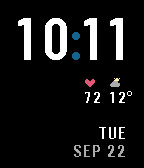 | 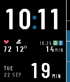 | 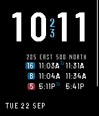 |

## Read past a sleeve

A cuff slides in from the wrist side and uncovers the outer edge first, so
everything on the face hangs from that edge in order of how much you need
it. The minute digits sit flush to it and survive a cuff that hides the
hour. The modules and the date hang from it too, the number of the date on
the edge itself: `SEP 22`. When there is a countdown it takes that edge and
the date moves to the wrist side, first to go. A rail down the outer edge
drains as the headway runs out, readable as a shape under any sleeve. Without
a countdown the edge is bare, until a flick: then a hairline down it drains
for as long as the flick's answer stays. On the right wrist the whole layout
mirrors.

## Out of the box

The time, two modules and the date. The modules are heart rate and the
weather, drawn as icons in colour: the heart red, the sun yellow by night and
orange by day, rain blue, clouds grey. A watch without a heart-rate sensor
shows its battery in that slot. The theme is dark through the night and light
by day; the night window is yours to set.

| dark | light | captions instead |
|---|---|---|
|  | 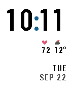 | 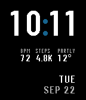 |

Three module slots take heart rate, steps, battery, weather or nothing, as
captions (`BPM 72`, `PARTLY 12°`), as grey icons, or as icons in colour. A
module with nothing to show — the weather before its first fetch — simply
does not appear. Weather comes from [Open-Meteo](https://open-meteo.com),
which needs no key.

## Near a system it knows

The face knows some transit systems and every stop in them. Most are just
that: stand at a stop, flick, and the face answers with what leaves next.
One kind is more: a system built around a hub, a transit centre whose routes
leave together, where the face also counts down to the next departure. By
default the phone checks where it is now and then, coarsely, and the face
changes by the answer. Outside every known system nothing changes and it
asks less often.

**At the hub**, in its hours, the countdown appears: minutes to the next
departure, at the outer edge. Five minutes out the block goes solid and the
watch buzzes once; at zero it reads `NOW` for a minute. The last minute counts
in seconds. Routes that keep their own timetable get a second countdown as
colour chips in the module band, with their departure's clock time small
beside them, and their last minute counts in seconds too.

| waiting | boarding | departing |
|---|---|---|
|  | 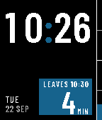 | 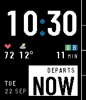 |

**A flick of the wrist** anywhere inside the system asks the phone where it
is and, for twelve seconds, lit, the face answers with the nearest stop. The
face never asks for high accuracy; it takes the phone's everyday fix at its
word, and reads every stop within that fix's accuracy of the nearest one. The answer is counted in rows, not metres. One row — one route, one
direction — sits in the band beside the modules as three short lines: the
stop, the badge and its next time, then how far, or the time after when you
are standing there. The rest of the face stays. Two or three rows take the
board: the time full size, the stop's name, a row a route with its badge in
the agency's own colour and two columns, and a small date at the foot. The
first column is the next time; the second holds one thing: the day when
today's buses are done (`5:12P TOMORROW`, `5:00A MON`), the direction where a
route runs both ways from a pair of stops across a road (`NORTH`, `SOUTH`),
otherwise the time after. A bus due this minute, or the minute just gone,
reads `NOW`, and one due the next minute `1 MIN`. Times read in the watch's own clock style, and
while the answer shows, the seconds sit small beneath the time at its outer
edge, since a board read against a timetable wants to know where in the
minute it is.

| one row, beside the modules | the board | a pair of stops, light |
|---|---|---|
| 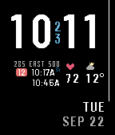 |  | 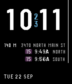 |

Stops across a road from each other are read as one. Off the stop, the line
says how far.

**At the transit centre** a dozen routes leave on the same minute, so a row a
route would show three of them. There the answer is by time instead: a line
a departure minute, the time at the outer edge and every route leaving then
as a badge beside it, in route order, wrapping when a wave is wider than the
line. Four lines fit where the date was: the loops, the half-hour wave, and
what follows. With the live feed, a flick there asks a different question,
the one asked standing in the bays: which buses are in? Every route that
leaves the transit centre that day is a badge on one line, in route order,
solid where its bus is at a bay now and hollow where it isn't, and under it
the loops' next departures, `G` and `B`, a line each. With no live answer it
is the departures by time, since nothing can be said about who is in. A
Pebble Classic has no room for it and keeps the board.

**At the yard,** Connect's headquarters in North Logan where the buses sleep,
a flick answers whether they are all back. The count takes the countdown's
place, as big: `3 OUT` under `BUSES STILL OUT`, or `0 OUT` under `ALL BUSES
IN`, counting every bus with a fresh position anywhere but the yard,
detoured ones included. The stop up the road sits beside the modules in one
row. With no live answer it is that stop, as anywhere else.

For an hour after the day's last trip the yard needs no flick: the face shows
the buses coming home by itself, the count in the countdown's place while
any are still on a trip, then `LAST TRIP ENDED` over `12 MIN AGO`, counting
up. The feed lists a bus only while it's on a trip, so none on one isn't all
in: the last bus may still be driving back, ten minutes or so, and the
minutes let the one at the gate judge. The hour is the timetable's, from the
latest arrival of the services running that day to the nearest quarter hour
(9 PM on weekdays, 7 on Saturdays: the loops' last lap back to the transit
centre runs a few minutes past), and the minutes run from when the last bus was last seen on
its trip, or from the timetable's end if it was never seen. Only a phone last
seen within a kilometre of the yard looks, every two minutes through that
hour; anywhere else nothing changes. A Pebble Classic has no room for the
count and answers as at any stop. A system names its yard with `--base
lat,lon,metres`, and the stop index then carries each service's end.

| at the transit centre | light | the minute it leaves |
|---|---|---|
| 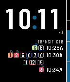 | 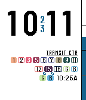 | 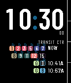 |

**Live times.** Where the agency publishes GTFS-realtime, a flick also asks
for predictions, and a predicted time carries a small arc in the accent: the
board's first time, the side block's time, a badge at the hub. A late bus
moves to the minute it will really leave; a bus that will skip the stop
drops out; a cancelled run drops out too; at the hub, and at any timepoint
where the timetable has the bus wait for its time, a bus is never shown
leaving early. A time without the
arc is the timetable's. At the hub the live feed also says which buses are
in: a route whose bus hasn't reached the transit centre yet has its badge
hollow, and solid once it's there. Only the next departure of each route is
drawn so; with no live answer every badge is solid, as before.


Every flick, anywhere, shows the seconds the moment the watch feels it:
under the time on the plain face, or, where the countdown is running, in
the block itself, where `19 MIN` becomes `18:42`, what is truly left. With
no stop within two kilometres that is all a flick shows: the gesture was
heard, and nothing is taken away to say there is nothing. The countdown steps aside for
a board and is back the moment it goes.

The face knows two systems so far. Connect, the Cache Valley Transit District
in Logan, Utah, is the hub kind: its routes leave the transit centre on the
half hour and its G and B loops keep their own timetable. UTA, from Ogden to
Provo, is the stops kind: TRAX, FrontRunner and the buses, with the rail
lines by the names riders use (`BLUE`, `RED`, `GRN`, `S`, `FR`) and every bay
of a station answering as one. Adding another is a GTFS feed; see Data below.

## Countdown everywhere

The face began as a countdown for any fixed-headway service — a train every
half hour, a shuttle every twenty minutes — and that is still here as a
setting. Choose it and the countdown runs wherever you are, from a headway
and a departure offset you set, with the hub's extras when you are at one.

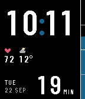

## Settings

From the Pebble app.

- **Transit** — automatic (default), countdown everywhere, or off. With it:
  how near the hub counts as at it, and a switch for the flick.
- **Headway** and **departure offset** — for the countdown: 30, 20 or 15
  minutes, and minutes past the hour.
- **Boarding buzz** — one pulse at five minutes: at the transit centre
  (default), wherever the countdown runs, or off.
- **Theme** — dark at night and light by day, with the night window; or
  dark; or light.
- **Accent** — any colour; the rail, the colon and the boarding block.
- **Wrist** — left or right.
- **Time format** — the system's, 12-hour or 24-hour.
- **Modules** — three slots, and captions, icons or icons in colour.
- **Units** — °C or °F, metres or feet. Automatic, the default, goes by where you are: °F and feet in the United States, °C and metres elsewhere.

## Data

The watch never reads a feed. `tools/transit.py` reduces an agency's GTFS to
what the phone needs: a file per stop with its departures, each naming the
service it runs on, and an index with the agency's whole calendar — weekly
patterns, dates added and dates taken away — so the phone works out which
buses run on the day it is asked about, holidays and all, and a bus the
agency writes as 24:53 runs at 12:53 the next morning. For a hub system it
also writes the hub, its hours and the departures of the routes on their own
timetable. The app's entry for each system goes in `src/pkjs/transit.json`;
the stop files are served by GitHub Pages from the `pages` branch, which a
nightly workflow rebuilds from the feeds and replaces whole, so old
timetables never pile up in the history. The index carries a version of
the timetable it was cut from, the same night after night until the agency
publishes a new feed; the phone keeps each stop's file until that version
changes, and after a flick keeps the stops within a few hundred metres of it,
so a flick there with no signal still has its timetable. Only a flick asks for
stop files; the background looks never do. The last 150 stops used are kept.

Each departure names its trip, from the agency's own GTFS, so live
predictions can be laid over it. For Connect they come from the relay at
`live.cacherider.com`, asked only for the stops being answered
(`?stops=id,id`). UTA's server turns relays away and its predictions name
no stop, only each trip's place in it, so the phone reads UTA's own
TripUpdate feed (about 170 KB, no key) and unpacks only the trips leaving
the stop in the next ninety minutes, matched by trip and `stop_sequence`
(`--live-by feed`). The live answer is an overlay and nothing more: the phone
waits three seconds for it at most, drops it if the feed's own clock is more
than ninety seconds old, and on any failure shows exactly the schedule it
would have shown without it. A system names its relay or feed with
`--live-url`, or has none.

To add a system: add its feed to `.github/workflows/transit.yml` with a line
running `tools/transit.py` (the feed, the agency, and a hints file for short
names and badge labels), and ship the new `transit.json` in a release. A hub
system also gives the hub's position and name and the routes that keep
their own timetable.

## Platforms

Rectangular displays: `aplite`, `basalt`, `diorite` and `flint` (144×168) and
`emery` (200×228). The layout is an edge-flush rail on a rectangle, so the
round `chalk` and `gabbro` are not targeted.

| aplite | diorite | emery | flint |
|---|---|---|---|
|  |  | 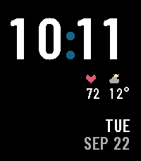 | 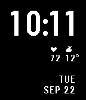 |

On one-bit watches the accent becomes ink, the badges go solid, and the
hairline under a stop name dots.

Every watch gives a face about 2 KB of stack, and the firmware's text
renderer wants well over half of it for each call. So the face keeps almost
nothing of its own beneath that call: each zone is laid out into static
storage and its painter hands one run of text at a time to a single small
leaf. Measured with the stack painted and read back, the deepest frame is
1800 bytes on `basalt` and on `flint`. Any new painter is written the same
way and measured before it ships.

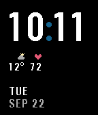

## Building

```bash
npm install
pebble build
pebble install --emulator basalt
```

The fonts are prebuilt. To regenerate them after changing a size or a
character set in `tools/genfonts.py`:

```bash
~/.local/share/uv/tools/pebble-tool/bin/python tools/genfonts.py
```

## Type

[Barlow Condensed](https://github.com/jpt/barlow) SemiBold at fixed pixel
sizes: 60px time (83 on emery), 44px countdown, 15px module values, 11px
labels, 12px date, 9px captions. Digits are set tabular and labels tracked
by drawing a glyph at a time. The board's clock times are the one exception:
Barlow Semi Condensed, the wider cut.

The SDK's font generator rasterises through the font's own hints, which
scatter one- and two-pixel stems across the small sizes. `tools/fontgen.py`
is that generator, vendored with FreeType's auto-hinter forced, and the
`.pfo` blobs it writes ship as raw resources. The 9px caption font is the
exception: it is drawn by hand, pixel by pixel, in `tools/fonts/cap_9.json`,
with one-pixel strokes, even bearings and the digits in one cell, and
`tools/pfo.py` writes it out; a rasterised 9px Barlow scattered two-pixel
stems where it pleased. Icons are hand-placed 10×10
pixel patterns, scaled by nearest neighbour, so they invert with the theme
and hold their shape on emery.

The face was designed with [Claude Design](https://claude.ai/design) and
built with Claude Code.

## Licence

Code under the MIT licence, see `LICENSE`. Barlow Condensed and Barlow Semi
Condensed are under the SIL Open Font License, see `resources/fonts/OFL.txt`.
